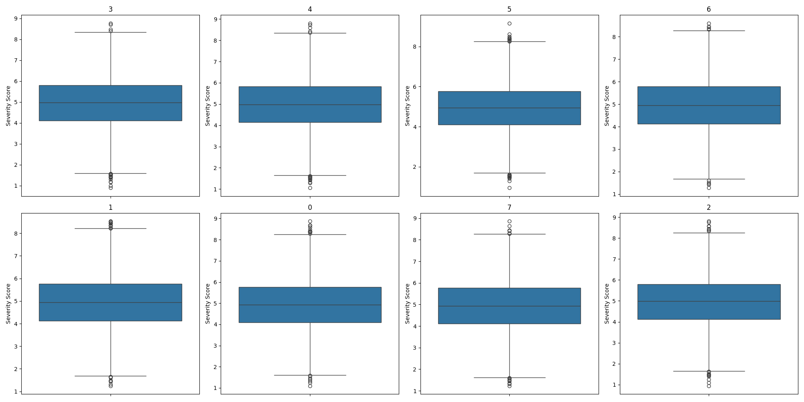
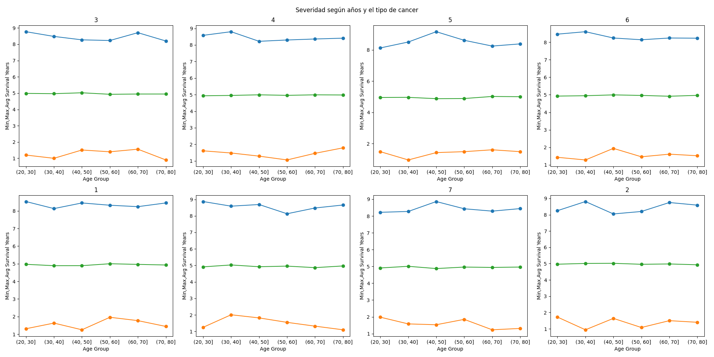
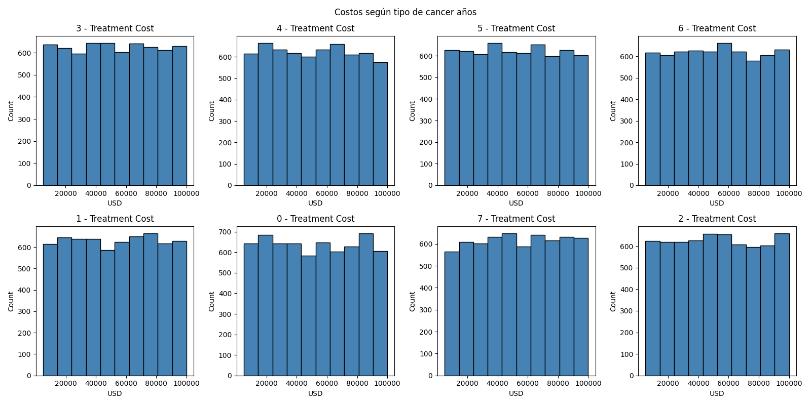

# Trabajo Académico final
Roberto Alvarado

25 de mayo del 2025

# Introducción
Para este trabajo académico final decidí hacer un pequeño análisis de un
dataset sobre cáncer, como el objectivo no es realizar una investigación ni modelo,
en este trabajo quiero centrarme en que con el uso de la tecnología podemos
entender, manipular y organizar los datos que a simple vista es imposible de
hacer sentido.

# Marco teórico de las tecnologías
Para este caso, solo explicaré cada una de las herramientas.
## Marco Teórico

En esta investigación se emplean herramientas de análisis y visualización de datos ampliamente utilizadas en el ecosistema de Python, seleccionadas por su robustez, versatilidad y compatibilidad entre sí. A continuación se describen brevemente cada una de ellas:

## Pandas
Pandas es una biblioteca para la manipulación y análisis de datos
estructurados. Permite limpiar y modificar un  conjuntos de
datos a través de estructuras como `DataFrame` y `Series` (McKinney,
2010). Su facilidad para integrar con otras bibliotecas de visualización y
machine learning la convierte en un pilar central del análisis exploratorio de
datos.

## Matplotlib

Matplotlib es una biblioteca de visualización que permite generar gráficos
estáticos con una gran personalización Es especialmente útil para crear gráficos lineales,
histogramas, y otros diagramas comunes para los analistas de datos.
Es una herramienta profundamente eficiente en su trabajo, pero se
queda un poco corta con respecto a la visualización de datos
de forma interactiva

## Bokeh

Bokeh es una biblioteca de visualización interactiva que facilita la creación
de gráficos interactivos . A diferencia de
`matplotlib`, permite desarrollar dashboards y gráficos con zoom, selección y
filtrado en tiempo real, lo que mejora la experiencia del usuario y la
exploración visual de grandes volúmenes de datos (Bokeh Development Team,
2023).

## Pygwalker

Pygwalker (Python-Grammar Walker) es una herramienta moderna que permite
generar visualizaciones interactivas de manera automática a partir de un
`DataFrame` de `pandas`. Se inspira en la experiencia visual de herramientas
como Tableau, permitiendo una exploración de los datos(Kanaries, 2023).

Esta herramienta es muy útil, y la utilizaré primeramente para ver como están
distribuidos los datos


# Descripción del dataset usado
La base de datos que utilice para esta investigación la encontre dentro de
Kaggle, global\_cancer\_patients\_2015\_2024, es un database que se encuentra
en csv. En realidad conseguir una base de datos que tenga tantos datos en
una base de datos y una en sql es complicado, entonces decidí guardar el
csv en un database. Por lo que tengo un database en csv y en sqlite.

Es un dataset que contiene al redor de 50000 personas que sufrieron de cáncer,
tiene un total de 13 atributos (Feroze Z, 2020)
```
Index(['Patient_ID','Age', 'Gender', 'Year', 'Genetic_Risk', 'Air_Pollution', 'Alcohol_Use',
       'Smoking', 'Obesity_Level', 'Cancer_Type', 'Cancer_Stage',
       'Treatment_Cost_USD', 'Survival_Years','Target_Severity_Score'],
      dtype='object')
```

Cada una de los atributos se explican por si mismo, pero para remarcar algunos
- Factores de riesgo, Air\_Pollution, Alcohol\_Use, Smoking,Obesity\_Level, estos atributos se consideran los factores de riesgo del cancer
- Survival\_Years es el número de años que sobrevivieron los pacientes desde el momento que se detecto el cancer
- Target\_Severity\_Score es un valor estandarizado de la severidad del cancer
- Cancer\_Type: En este database tenemos 7 tipos  de cancer


# Descripción de los pasos realizados en el proyecto
1. Primeramente la elección de la base de datos, conseguir una base de datos con sql es
dificil si ya esta en csv, sobretodo si no se utiliza las herramientas de microsoft, por
esa razón conseguí la base de datos global\_cancer\_patients\_2015\_2024,y la transforme en una base
de datos sql con sqlite3  en linux, con estos comandos
```
sqlite3 cancer.db
sqlite3> .mode csv
sqlite3> .import global\_cancer\_patients\_2015\_2024.csv
sqlite3> .exit
```
Después de eso podemos proseguir

2. Después podemos hacer una lectura de los datos y una limpieza, aqui no hay mucho
que decir y en el notebook se explica mejor, pero en general era eliminar las
columnas que no son necesarias, por ejemplo, el Patient\_ID que es simplemente
un id de la columna

3. Comenzar a ver los datos, para eso utilizaré la herramienta de Pygwalker, esta
herramienta es muy útil para explorar la base de datos.


 También agregue unas visualizaciones que se pueden importar dentro de la app
[Aqui](./pygwalker_figures)

4. Comenzar con las visualizaciones, aqui intento responder preguntas,
por ejemplo,
- ¿Como esta distribuida la base de datos según los géneros?

Aqui parece que esta distribuida de manera equitativa para todos los géneros

- ¿Como esta distribuida la base de datos según los tipos de cancer?

Aqui parece que esta distribuida de manera equitativa para todos los tipos de
cancer


- Existe buena representividad de casos de severidad


- Como están distribuidos los casos de severidad según el tipo de cancer?

Podemos utilizar un diagrama de boxplot, que nos dice datos estadísticos de los datos,
nos dicen, los quantiles, el maximo, media, minimo y outliers.\
Aqui podemos ver que para todos los tipos de cancer, la media de severidad es
similar, sin embargo, podemos ver que el los máximos son diferentes, y los casos
de outliers es más común en ciertos casos. Por ejemplo, el cancer de colon de una mujer parece
que tiene un tercer quantil más alto

- ¿La Severidad de los casos es similar entre todos los grupos de edades?

Parece que los datos indican que no hay mucha diferencia entre los grupos de edad

- ¿El Costo de los tratamientos es diferente entre el tipo de cancer?

Estos gráficos nos dicen cuantos casos entran en un rango de costos, por ejemplo,
cada barra del primer gráfico, nos dice cuantos pacientes tuvieron que pagar ese
valor para el cancer de cervix Podemos ver que existen Tipos de cancer como el de púlmon donde el costo
del tratamiento tiene tendencia a ser más costoso. O el cancer de piel que parece tender a ser menos
costoso


- Ahora podemos ver la relación entre atributos, para eso por ejemplo el gráfico

Aqui podemos ver la relación entre la obesidad y la severidad, para esto hice
utilicé la herramienta Bookeh, por lo que es interactivo dentro del notebook

- Y finalmente solo para ver que más se puede hacer con Matplotlib,

Queremos ver si el consumo de cigarro se relaciona a una mayor severidad. Después de un análisis
de regresión lineal podemos ver que si.
# Conclusiones
Este análisis es un primer paso para comprender un tema complejo, pero
demuestra el valor de las herramientas de visualización como punto de partida
para explorar grandes volúmenes de datos. Gracias a bibliotecas como
Matplotlib, Bokeh y Pygwalker, fue posible identificar patrones, contrastar
variables y generar preguntas que podrían guiar investigaciones más profundas
en el futuro. Aunque este trabajo no busca ofrecer respuestas definitivas, deja
claro que visualizar los datos no solo facilita su comprensión, sino que
también es clave para descubrir relaciones que de otro modo pasarían
desapercibidas.
# Bibliografía
- Bokeh Development Team. (2023). *Bokeh documentation*. https://docs.bokeh.org
- Kanaries. (2023). *pygwalker documentation*. https://github.com/Kanaries/pygwalker
- McKinney, W. (2010). Data structures for statistical computing in Python. In *Proceedings of the 9th Python in Science Conference* (Vol. 445, pp. 51–56).
- Zahid Feroze  (2022) global\_cancer\_patients\_2015\_2024. https://www.kaggle.com/datasets/zahidmughal2343/global-cancer-patients-2015-2024

